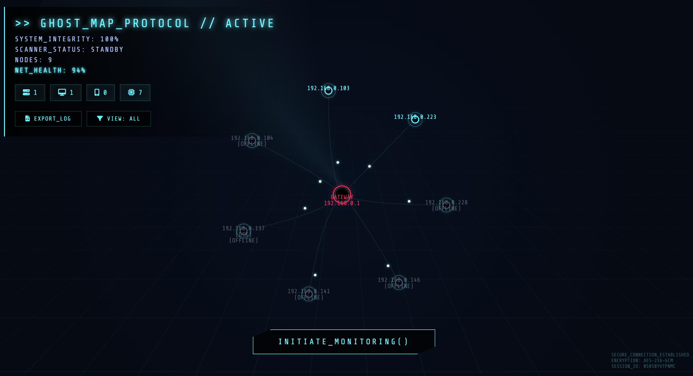

# 👻 Ghost Map Protocol

<div align="center">

**Real-time network topology visualization with a Ghost-map aesthetic for begginers in CS**

[](https://www.python.org/downloads/)
[](https://flask.palletsprojects.com/)
[](LICENSE)

🔍 **Live Network Scanning** • 🎨 **Ghost Map UI** • 📊 **Device Analytics** • 🛡️ **Security Hardened**



</div>

---

## ✨ Features

- **🔄 Continuous Monitoring** - Start/Stop real-time network scanning with device persistence
- **👁️ Ghost Map Visualization** - themed network topology using vis.js
- **🎯 Active/Inactive Tracking** - Devices remain on the map even after disconnection, marked as offline
- **🔍 Smart Device Detection** - Automatic device type identification (router, desktop, mobile, server)
- **📡 Dual Scanning Modes**:
  - **Scapy Mode** - Advanced ARP scanning (requires root)
  - **System Mode** - Fallback ping sweep + ARP table parsing (no dependencies)
- **🔬 Deep Analysis** - Nmap integration for OS detection and service scanning
- **📊 Network Health Monitoring** - Real-time quality scoring based on latency and device status
- **💾 Export Reports** - Generate Markdown reports with full device inventory
- **🎨 Pleasant Details** - Data packet animations, pulsing nodes, radar sweep effects
- **🔒 Security First** - Input validation, CSP headers, secure subprocess calls

---

## 🚀 Quick Start

### Prerequisites

- **Python 3.9+**
- **macOS/Linux** (Windows not tested)
- Optional: `nmap` for advanced scanning
- VPN services must be disabled

### Installation

```bash
# Clone the repository
git clone https://github.com/yourusername/ghost-map.git
cd ghost-map

# Install dependencies
pip3 install -r requirements.txt

# Run the application
python3 app.py
```

The app will automatically detect your local IP and bind to it. Access the interface at:
```
http://192.168.X.X:5001
```

### 🔓 Enhanced Mode (Optional)

For full ARP scanning capabilities with Scapy:
```bash
sudo python3 app.py
```

---

## 📖 Usage

1. **Start Monitoring** - Click `INITIATE_MONITORING()` to begin continuous scanning
2. **View Devices** - Devices appear as nodes in the network graph
3. **Inspect Nodes** - Click any device to view detailed information
4. **Advanced Scan** - Use the Nmap button in device details for deep analysis
5. **Export Data** - Click `EXPORT_LOG` to download a Markdown report
6. **Stop Monitoring** - Click `TERMINATE_MONITORING()` to pause scanning

### Device Status

- **Active** (Cyan/Green) - Currently online and responding
- **Inactive** (Gray + OFFLINE) - Previously seen but now disconnected

---

## 🏗️ Architecture

```
ghost-map/
├── app.py                 # Flask server, API endpoints, continuous scanning logic
├── scanner.py            # Network scanning (Scapy/System fallback)
├── templates/
│   └── index.html        # Main UI template
├── static/
│   ├── css/
│   │   └── style.css     # Ghost Map aesthetic styling
│   └── js/
│       └── main.js       # vis.js network graph, monitoring logic
└── requirements.txt      # Python dependencies
```

### Technology Stack

- **Backend**: Flask, Python 3.9+
- **Scanning**: Scapy (optional), ping, arp
- **Frontend**: Vanilla JavaScript, vis.js
- **Styling**: Custom CSS with animations

---

## 🔧 Configuration

### Scan Interval

Default: **5 seconds** (when monitoring is active)

Edit in `app.py`:
```python
time.sleep(5)  # Line 69
```

### Port Scanning

Customize ports in `scanner.py`:
```python
common_ports = {
    22: 'SSH',
    80: 'HTTP',
    443: 'HTTPS',
    # Add your ports here
}
```

---

## 🛡️ Security Features

✅ **Input Validation** - All user inputs sanitized using `ipaddress` library  
✅ **Security Headers** - CSP, X-Frame-Options, X-Content-Type-Options  
✅ **Safe Subprocess Calls** - List-based arguments prevent command injection  
✅ **Minimal Attack Surface** - No debug mode, no unnecessary endpoints  
✅ **Local Binding** - Binds to LAN IP by default (not 0.0.0.0)

---

## 🐛 Troubleshooting

### "Scapy not available" Warning
This is normal! The app will use the system fallback scanner (ping + arp).

### No Devices Found
1. Ensure you're on the same network subnet
2. Try running with `sudo` for better scanning
3. Check firewall settings

### Architecture Mismatch Errors
```bash
# Reinstall dependencies from source
pip3 uninstall -y netifaces
pip3 install --no-cache-dir --no-binary :all: netifaces
```

---

## 📝 TODO / Roadmap for forks propositions

- [ ] Add Docker support
- [ ] Implement device grouping/filtering
- [ ] Add historical device tracking
- [ ] Create REST API documentation
- [ ] Add unit tests
- [ ] Support for Windows

---

## 🤝 Contributing

Contributions are welcome! Please feel free to submit a Pull Request.

1. Fork the repository
2. Create your feature branch 
3. Commit your changes
4. Push to the branch 
5. Open a Pull Request

---

## 📄 License

This project is licensed under the MIT License - see the [LICENSE](LICENSE) file for details.

---

## 🙏 Acknowledgments

- **vis.js** - Network visualization library
- **Scapy** - Packet manipulation library
- **Flask** - Python web framework
- Inspired by Ghost map // OSINT aesthetics and hacker culture

---

<div align="center">

**Made 💀 by R4ggedy**

⭐ Star this repo if you find it useful!

</div>
